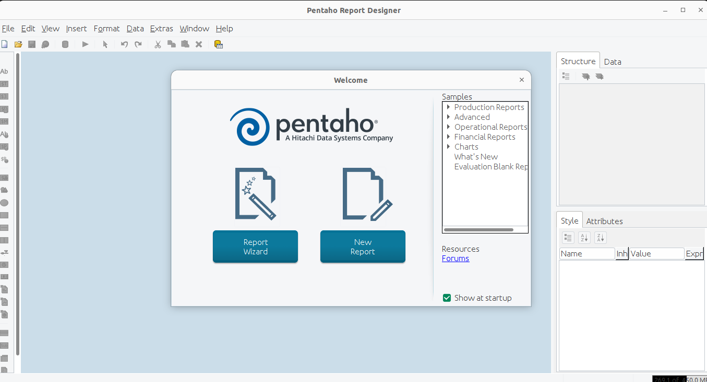

# Pentaho
You can find evething about Pentaho. For example, some ETLs and Reports

## 1. Install Java

### 1.1 Java Installation Instructions on 64-bit Linux

https://www.java.com/es/download/help/linux_x64_install.html

This article applies to:
Platforms: Red Hat Linux, SUSE Linux, Oracle Linux, Oracle Enterprise Linux, Ubuntu Linux, SLES
Java versions: 7.0, 8.0

Linux System Requirements
See Supported System Configurations for information on supported platforms, operating systems, desktop managers, and browsers.

To download and install Java for Linux, follow this process.

Download

This procedure installs the Java Runtime Environment (JRE) for 64-bit Linux using a binary archive file (.tar.gz).

1. Go to http://java.com and click the Download button.
2. You must accept the license agreement to download the file.
3. Download and check the size of the downloaded file to ensure you have downloaded the entire software package and that it is not corrupted. Before downloading the file, check its size in bytes indicated on the website's download page. Once the download is complete, compare that size with the downloaded file to ensure they are the same.

Installation

The instructions below are for installing Java 8 Update 73 (8u73). If you are installing a different version, change the version number accordingly when typing commands in the terminal. Example: For Java 8u79, replace 8u73 with 8u79. Note that, as in the previous example, the version number is sometimes preceded by the letter u and sometimes by an underscore, for example, jre1.8.0_73.

<b>Nota para el acceso raíz:</b> Para instalar Java en una ubicación que afecte a todo el sistema, como /usr/local, debe conectarse como el usuario raíz para contar con todos los permisos necesarios. Si no tiene acceso de usuario root, instale Java en su directorio de inicio o en un subdirectorio para el que disponga de permiso de escritura.

1. Change to the directory where you want to install. Type:

    
cd directory_path_name

    
For example, to install the software in the /usr/java directory, type:

    
cd /usr/java/

2. Move the .tar.gz archive binary file to the current directory.

3. Unpack the tarball and install Java

    tar zxvf jre-8u73-linux-x64.tar.gz

    The Java files are installed in a directory named jre1.8.0_73 in the current directory. In this example, it was installed in the /usr/java/jre1.8.0_73 directory. Once the installation is complete, the message Complete appears.

4. Delete the .tar.gz file if you want to save disk space.

### 1.2 Install Java on Windows

https://www.java.com/es/download/help/windows_manual_download.html

This article applies to:
Platforms: Windows 2008 Server, Windows 7, Windows 8, Windows XP, Windows Server 2012, Windows Vista, Windows 10
Java versions: 7.0, 8.0

The Java installation procedure is broadly as follows:
1. Download and install
2. Test the installation
3. Windows system requirements

<b>Note:</b> Java installation requires you to be able to access Windows as an administrator on your computer.

Download and Installation

It is recommended that you disable your Internet firewall before proceeding with the online installation. In some cases, the default firewall settings are set to deny all automatic or online installations, such as the online installation of Java. If the firewall is not configured correctly, it may prevent the download/installation of Java under certain circumstances. Refer to the instructions in your Internet firewall manual for disabling it.

Click Windows Online.

The File Download dialog box will appear, prompting you to run or save the downloaded file.

    To run the installer, click Run.
    
    To save the file and run it later, click Save.
    Select the folder location and save the file to your local system.
    Tip: Save the file to a familiar location on your computer, for example, the desktop.
    Double-click the saved file to begin the installation process.
    The installation process will begin. Click the Install button to accept the license terms and continue with the installation.

The installation process will begin. Click the Install button to accept the license terms and continue with the installation.

Oracle collaborates with companies that offer various products. The installer may offer you the option to install these programs as part of the Java installation. Once you have selected the desired programs, click Next to continue the installation process.

Several dialog boxes will open with information to complete the final steps of the installation process; click Close in the final dialog box. This will complete the Java installation process.

## 2. How to run Data Integration

2.1. Go to the Data Integration root path 

2.2 For example: cd /opt/pentaho/pdi/data-integration/

2.3 sh -x  spoon.sh

## 3. How to run Report Designer

3.1 Go to the Report Designer root path 

3.2 For example: cd /opt/pentaho/prd/report-designer/

3.3 sh -x report-designer.sh

## 4. How to run Pentaho Server

4.1 Go to the Pentaho Server root path 

4.2 For example: cd /opt/pentaho/pentaho-server/

4.3 sh -x start-pentaho.sh 

4.4 It's possible to change the default port: 8080

cd /opt/pentaho/pentaho-server/tomcat/conf/

nano server.xml

--<Connector port="8787" protocol="HTTP/1.1"
               connectionTimeout="20000"
               redirectPort="8443" />

port="8787"
redirectPort="8443"